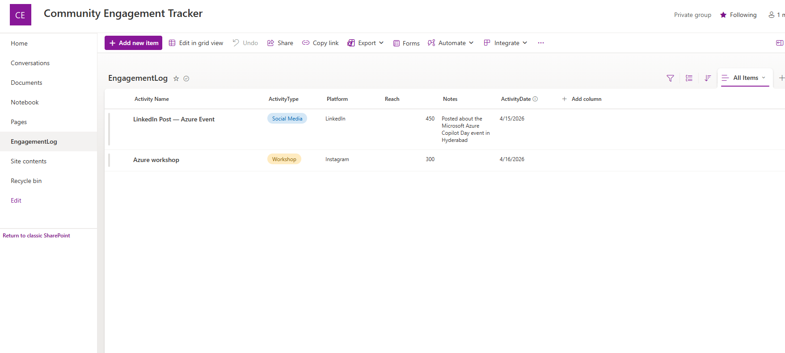
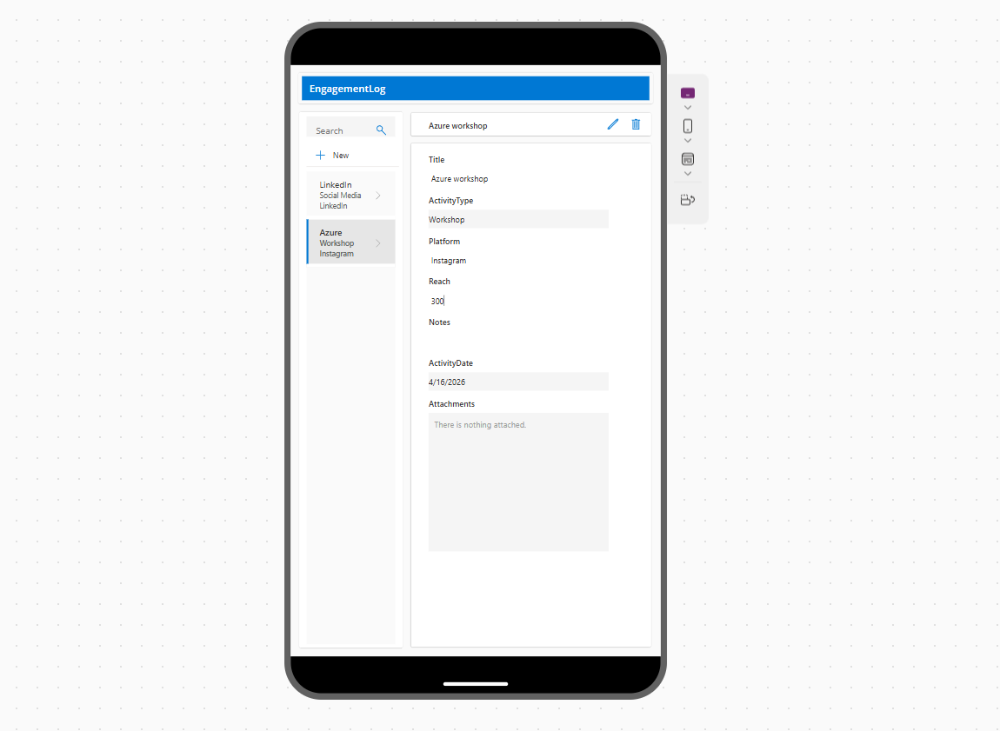
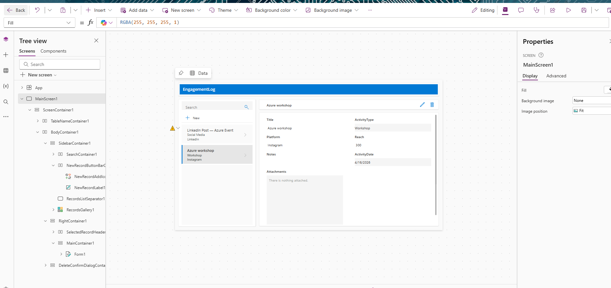
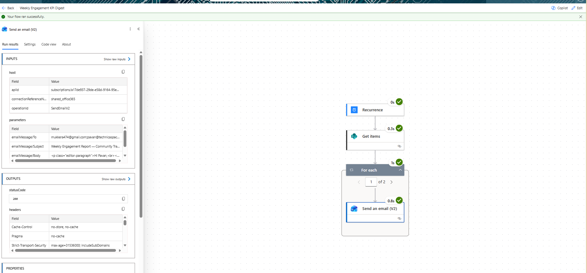

# Community Engagement Tracker

A Power Platform solution built to automate community engagement tracking.

## Tools Used
- Microsoft Power Apps (Canvas App)
- Microsoft Power Automate (Scheduled cloud flow)
- Microsoft SharePoint (Data storage)
- Microsoft Excel (KPI Dashboard)

## What it does
- Canvas App for logging digital engagement activities
- SharePoint list stores all data in real time
- Automated weekly KPI email every Monday via Power Automate
- Excel dashboard showing reach by platform and activity type

## Demo
Watch the full demo here:
https://www.loom.com/share/23cfe5dc254943c997ab74a8a153a5f0

## Screenshots

## Problem it solves
Built based on a real challenge experienced during my internship 
managing digital engagement activities manually in spreadsheets.
This app eliminates manual logging and automates weekly reporting.

## Project Status
Completed — April 2025
